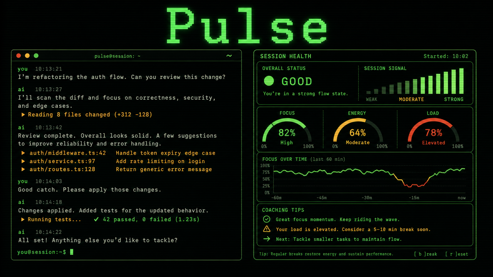

# Pulse — Session Health Monitor for AI Conversations



Pulse is a harness-neutral session quality engine with native integrations for Hermes Agent and Pi. It analyzes conversations with evidence-based signals attributed to the user, agent, or system, while preserving each harness's native session and state model.

## Commands

| Command | Description |
|---|---|
| `/pulse` | Analyze the current/latest session |
| `/pulse trends` | Show the latest 20 analyses |
| `/pulse models` | Compare analyzed models |
| `/pulse useful` / `/pulse not-useful` | Rate the latest analysis (idempotent) |
| `/pulse yes` / `/pulse no` | Rate whether the session solved the problem |

The CLI supports `--file`, `--session`, and `--json`. `pulse analyze` is the versioned stdin/stdout JSON protocol used by adapters. `--deep` is reserved and explicitly **not implemented**; Pulse currently performs deterministic analysis only.

### `--unroll` mode

Score an unroll trace file (safe AST load, never executed):

```bash
uv run pulse --unroll ~/.hermes/traces/unrolled/<session>.py
uv run pulse --unroll ~/.hermes/traces/unrolled/<session>.py --json
```

Trace files carry TIMELINE steps but not full message text, so text-based
detectors degrade in this mode while timing/cost/graph signals are
authoritative. Three unroll-native detectors run on top of the standard set
(all thresholds **provisional** until ~100-session calibration):

- `latency_regression` (warning) — any step with `duration_ms > 5000`
- `cost_anomaly` (warning) — `cost_usd` above task ceiling (brainstorm $0.50, coding $5.00)
- `skill_deadweight` (warning with correction, else info) — skill in `ACTIVE_SKILLS` with zero `tool_call` steps

### Session gym

```bash
uv run python scripts/build_corpus.py --out corpus   # keep bottom-10 traces + sidecar JSON
```

A weekly cron (`pulse-session-gym-weekly`, Mondays 09:00) rescores the corpus
plus the week's new traces and reports worst session, total cost, and top
recurring signal.

### Leaderboard

```bash
uv run pulse leaderboard --corpus corpus            # terminal table
uv run pulse leaderboard --corpus corpus --json     # machine output
```

Loads `*.score.json` sidecars (scores `*.py` traces live when a sidecar is
missing). Ranks top/bottom 3 per task type; session IDs are anonymized
(sha256, first 12 chars); score ties break toward lower cost.

## Native integrations

### Hermes Agent

The Hermes integration is a native `/pulse` plugin using Hermes's shared session store. It supports trend and model views across analyzed Hermes sessions.

### Pi

A native TypeScript extension lives in [`pi/`](pi/README.md). Run `pi -e ./pi/extensions/pulse.ts` from a checkout, or install the local package with `pi install ./pi`. It reads only Pi's public active-branch APIs, invokes the local `pulse analyze` protocol, and never parses Pi JSONL or Hermes SQLite. It provides the `/pulse` commands plus the optional `pulse_analyze` tool. Automatic analysis is opt-in via `PULSE_AUTO_ANALYZE=1` and runs after `agent_settled`.

Both integrations feed the same versioned normalized-message protocol and deterministic Python engine. Pi persists analysis and feedback as branch-local custom entries, so in-place branches do not leak results into sibling branches.

## Installation

From a checkout:

```bash
git clone https://github.com/dark5un/pulse.git ~/workspace/github.com/dark5un/pulse
cd ~/workspace/github.com/dark5un/pulse
PULSE_SOURCE_DIR="$PWD" bash install.sh
hermes plugins enable pulse
```

The installer places the native Hermes manifest and `__init__.py` under `${HERMES_HOME:-$HOME/.hermes}/plugins/pulse`. It can be rerun safely. `uninstall.sh` removes the plugin and learned weights but deliberately retains analysis data in `state.db`.

## Data and semantics

- Hermes state is profile-safe: `HERMES_HOME` selects `state.db`, `plugins/`, and `pulse_weights.json`; otherwise `$HOME/.hermes` is used.
- A session is analyzed only when it has **at least 5 total messages and at least 3 user turns**.
- Scores are clamped to 0–100. Attribution fields are normalized penalty shares: clean sessions return all zeroes, while non-clean sessions sum to 100%; system/other penalties contribute to `other_blame_pct`.
- Re-analysis updates analysis columns with an explicit SQLite upsert, preserving `feedback_rating` and `outcome_rating`.
- Repeating a feedback command reports that the result is already rated and does not add another learned-weight event. Rating changes are rejected to preserve event accounting.
- Pi feedback has independent usefulness (`useful`/`not-useful`) and outcome (`yes`/`no`) dimensions; repeats are idempotent and polarity changes are rejected. Automatic Pi analysis keys on the current ordered branch revision and retries failed invocations.
- The installer copies a self-contained plugin package, so loading works from an external working directory without repository `PYTHONPATH` or a resolved source symlink.
- Malformed session tool-call JSON is ignored safely. Explicit `tool_name` is preserved and used for runtime provenance.

## Development

```bash
uv sync --extra dev
uv run ruff check src/ tests/
uv run pyright src/pulse/ tests/
uv run pytest tests/ -q
```

Tests use an autouse temporary `HERMES_HOME`; they never write the developer's real Hermes state. The native plugin contract is `plugin.yaml` plus `__init__.py` exposing `register(ctx)`, as documented by Hermes Agent.

## Architecture

- `src/pulse/signals.py` — pure deterministic detectors
- `src/pulse/signals_unroll.py` — unroll-native detectors (latency, cost, skill deadweight; provisional thresholds)
- `src/pulse/unroll_loader.py` — safe trace loader (AST only, never executes) + timeline→messages
- `scripts/build_corpus.py` — session-gym corpus curator (bottom-10 + sidecar JSON)
- `src/pulse/task_type.py` — precedence-based classification
- `src/pulse/session_store.py` — shared defensive SQLite loader
- `src/pulse/weights.py` — validated atomic learned state
- `src/pulse/plugin.py` — slash command, persistence, and presentation

## License

MIT

Repository: https://github.com/dark5un/pulse

Every signal is a heuristic and should be treated as provisional.
